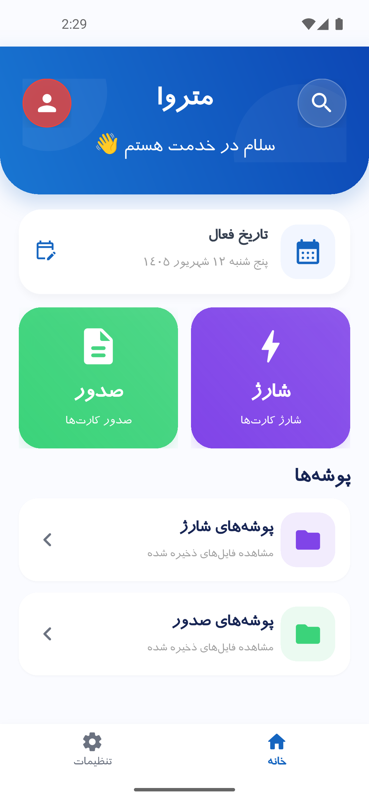
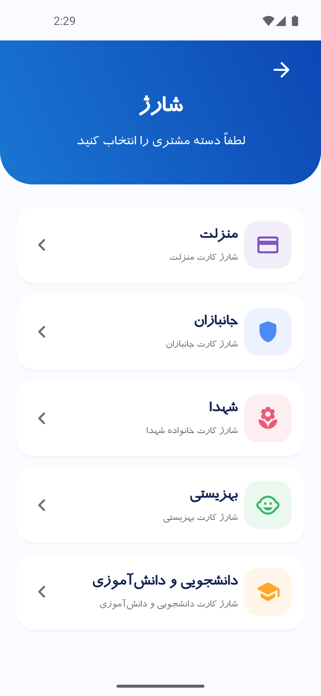
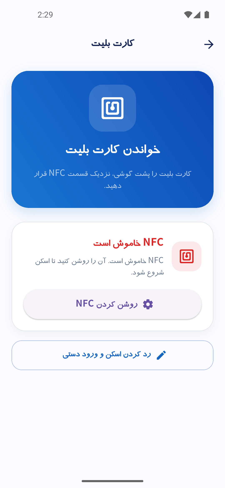
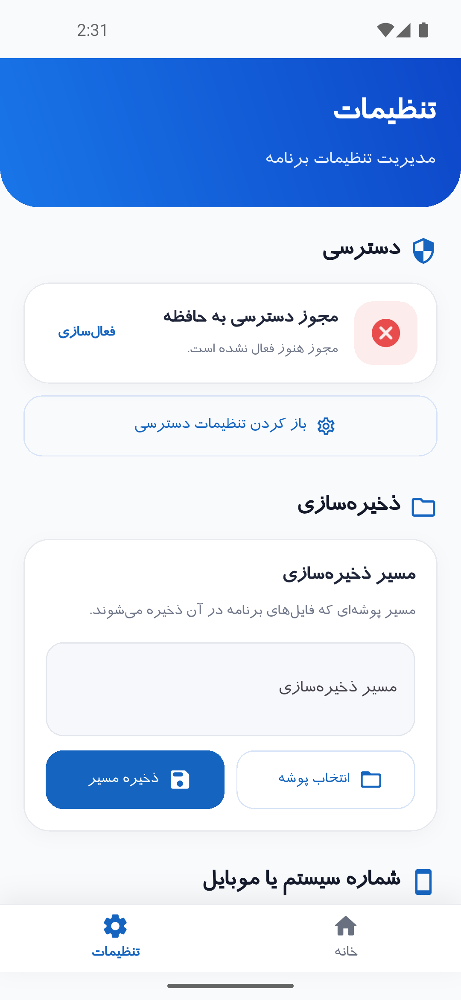

# Metroa

<div align="center">

### Smart Metro Card Charging & Customer Document Management

**Metroa** is a Flutter-based application developed by **Knightra** to streamline the process of collecting customer information and documents and using them to manage and charge metro transit cards.

<br>

**Built with Flutter & Dart**

</div>

---

## 📌 Overview

**Metroa** is a specialized application designed to simplify and organize the workflow of charging metro transit cards based on customer information and required documents.

Instead of relying on a scattered collection of photos, files, folders, and manual processes, Metroa brings the essential workflow into a single application.

The application allows operators to:

- Capture customer documents using the device camera
- Crop and prepare document images
- Read metro card information using NFC
- Organize customer-related files and documents
- Manage folders and stored images
- Compress folders into ZIP archives
- Share generated files and archives
- Receive shared images and files directly into the application
- Track relevant customer and receipt states
- Work with Persian dates and a Persian-first interface

> **Make the process of collecting customer documents and managing metro card charging faster, more organized, and less error-prone.**

---

## ✨ Features

### 📷 Document Camera

Metroa includes an integrated camera workflow for capturing customer documents directly from the application.

### ✂️ Document Cropping

Captured document images can be cropped before being stored, helping keep the final files clean and focused on the required information.

### 📡 NFC Card Reading

The application uses NFC to interact with supported metro transit cards and read the required card information, reducing the need for manual entry.

### 📁 Customer File Management

Customer-related documents and images can be organized through the application's file-management workflow.

- Creating and managing folders
- Opening folders
- Viewing stored images
- Renaming items
- Managing files
- Sharing files
- Compressing folders

### 🗜️ ZIP Compression

Customer folders can be compressed into ZIP archives, making it easier to package multiple documents and share them as a single file.

### 📤 File Sharing

Metroa supports sharing files and ZIP archives through the device's available sharing mechanisms.

### 📨 Share Intent Support

Images shared from other applications can be received directly by Metroa.

**Another application → Share → Metroa → Process document**

### 🧾 Receipt & Customer Workflow

The application includes a workflow for associating receipt images with the relevant customer process, helping keep supporting documents connected to the corresponding customer information.

### 📅 Persian Date & Localization

Metroa is designed with a Persian-first interface and supports Persian localization and date handling.

---

# 🔄 Core Workflow

```text
Customer
   │
   ▼
Collect Information & Documents
   │
   ├── Camera
   │     └── Capture Document
   │            └── Crop
   │
   ├── Existing Images
   │     └── Share to Metroa
   │
   ▼
Organize Customer Files
   │
   ▼
Read Metro Card
   │
   └── NFC
   │
   ▼
Process / Charge Card
   │
   ▼
Store Related Documents
   │
   ▼
Compress / Share
   │
   └── ZIP
```

---

# 🖼️ Screenshots

### 🏠 Home



### 💳 Charging Workflow



### 📡 NFC Card Reading



### ⚙️ Settings



---

# 🛠️ Tech Stack

Metroa is built using **Flutter** and **Dart**.

## Core Technologies

| Technology | Purpose |
|---|---|
| Flutter | Cross-platform application framework |
| Dart | Application programming language |
| Material Design | UI foundation |
| Flutter Localizations | Localization support |

## Main Packages

| Package | Purpose |
|---|---|
| `camera` | Camera access and document capture |
| `crop_image` | Image cropping |
| `image` | Image processing and optimization |
| `nfc_manager` | NFC communication |
| `nfc_manager_ndef` | NFC NDEF support |
| `filesystem_picker` | File and directory selection |
| `path_provider` | Application filesystem paths |
| `archive` | ZIP compression and archive handling |
| `share_plus` | File sharing |
| `receive_sharing_intent` | Receiving shared media |
| `open_filex` | Opening files with supported applications |
| `permission_handler` | Runtime permission management |
| `shared_preferences` | Local lightweight data persistence |
| `shamsi_date` | Persian/Shamsi date handling |
| `persian_datetime_picker` | Persian date selection |

---

# 🏗️ Architecture

Metroa follows a feature-oriented Flutter structure in which application screens are separated from supporting services and data models.

```text
lib/
├── pages/
├── services/
├── models/
└── main.dart
```

### `pages/`

Contains the application's UI screens and user-facing workflows.

### `services/`

Contains reusable application logic, including functionality related to:

- File management
- Customer status
- Permissions
- Storage
- Date handling
- NFC
- Receipt handling

### `models/`

Contains data structures used to represent application entities and information.

### `main.dart`

The application entry point is responsible for bootstrapping the Flutter application, configuring localization and navigation, and handling incoming shared media.

---

# 📂 Project Structure

```text
metroa/
│
├── android/
├── ios/
├── macos/
├── windows/
│
├── assets/
│   └── fonts/
│
├── lib/
│   ├── models/
│   ├── pages/
│   ├── services/
│   └── main.dart
│
├── test/
│
├── analysis_options.yaml
├── pubspec.yaml
├── pubspec.lock
├── .gitignore
└── README.md
```

---

# 🚀 Getting Started

## Prerequisites

Before running the project, make sure you have:

- Flutter SDK installed
- Dart SDK compatible with the project
- Android Studio and/or an Android development environment for Android builds
- Xcode for iOS/macOS development on macOS
- A physical NFC-capable device for testing NFC functionality

The current project configuration specifies a Dart SDK environment of:

```text
^3.12.2
```

## Installation

### 1. Clone the repository

```bash
git clone https://github.com/AmiraliRnjn/manzelat.git
```

### 2. Enter the project directory

```bash
cd manzelat
```

### 3. Install dependencies

```bash
flutter pub get
```

### 4. Check your Flutter environment

```bash
flutter doctor
```

### 5. Run the application

```bash
flutter run
```

### Warning

We used Iranian gradle to run this app
---

# 📱 Platform Support

The repository currently contains native project configurations for:

- Android
- iOS
- macOS
- Windows

Some functionality depends on platform-specific APIs and hardware.

In particular:

- NFC requires compatible hardware
- Camera functionality requires camera access
- File operations depend on platform storage APIs
- Sharing functionality depends on platform capabilities and permissions

For reliable validation of NFC and camera workflows, testing on a physical mobile device is recommended.

---

# 🔐 Permissions & Hardware

Depending on the platform and workflow, Metroa may require access to:

- 📷 Camera
- 📡 NFC
- 📂 Files / Storage
- 📤 Sharing functionality

Permissions are handled through the application's permission-management layer and platform-specific configuration.

---

# 🧪 Testing

The project includes a Flutter test directory and uses Flutter's testing framework.

Run tests with:

```bash
flutter test
```

Hardware-dependent workflows should also be tested on physical devices, especially:

- Camera capture
- Image cropping
- NFC reading
- File operations
- ZIP creation
- File sharing
- Receiving shared media
- Runtime permissions

---

# 📦 Application Version

Current project version:

```text
1.0.0+1
```

This value is defined in `pubspec.yaml` and can be updated as the application progresses through future releases.

---

# 🗺️ Roadmap

Metroa is currently focused on providing a reliable and efficient workflow for customer document collection, organization, and metro card charging.

Potential future improvements may include:

- Improved backup and restore
- More advanced search and filtering
- Enhanced file management
- Better error recovery
- Additional customer-management capabilities
- Improved analytics and reporting
- Performance optimization
- Stronger data protection
- Further automation of repetitive workflows
- Additional UI/UX refinement

> The roadmap is intentionally flexible and may change according to real-world usage and team priorities.

---

# 👥 Team

## Knightra

Metroa is developed by **Knightra**.

### Team Members

| Member | Role |
|---|---|
| **[Mani Parvandi](https://github.com/x8drag6x)** | Developer |
| **[Amirali Ranjbaran](https://github.com/AmiraliRnjn)** | Developer |

---

# 🎯 Project Vision

Metroa is designed to bring the repetitive parts of the metro-card charging workflow into one organized environment.

The long-term vision is to reduce manual data entry, minimize document-management errors, speed up day-to-day operations, and provide a reliable workflow for handling customer information and related files.

---

# 🤝 Contributing

Metroa is currently developed by the **Knightra** team.

If you would like to contribute or suggest an improvement, please open an issue describing:

1. The problem
2. The expected behavior
3. The proposed solution
4. Any relevant screenshots or examples

For larger changes, discussing the idea with the team before implementation is recommended.

---

# 📄 License

A project license has not been specified yet.

Until an official license is added to the repository, the source code should not be assumed to be freely reusable, modified, or redistributed.

**License: TBD**

---

# 🔗 Repository

[GitHub — Knightra / Metroa](https://github.com/AmiraliRnjn/manzelat)

---

<div align="center">

### Built with ❤️ by Knightra

**Metroa — Simplifying the Metro Card Charging Workflow**

</div>
